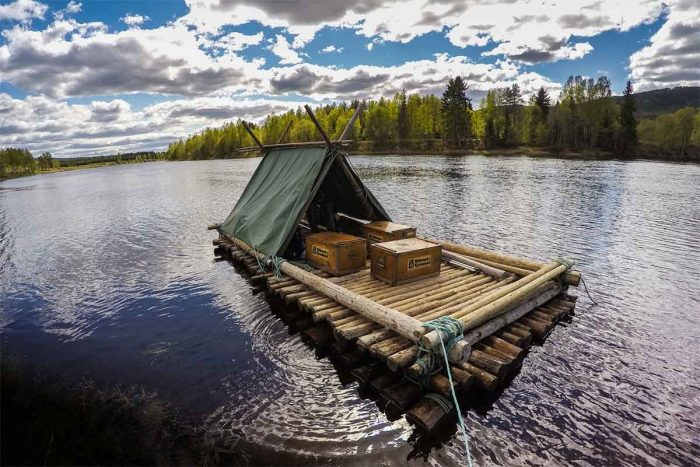

# README #

### What is this repository for? ###

# Driftwood
You are on an eternally floating boat, can find traders, store food and water, minigames, make ship better.

_possibly multiplayer but no direct p2p interaction intiially_

Aim: To provide a fun and casual game that changes in real time
Audience: Commuters, Casual players, kids
Notes:

- Minigames and more frequent events while player is looking
- Players can show off, decorate their boat, guilds/clans/groups
- Island minigames

Why would someone play this?

* Addictiveness (real time things happening)
* Exploring, can settle clan islands, maybe do competitive in clans 
* Challenge in keeping the boat afloat, surviving, with random events
* Loot/treasure

### Ideas to think about ###

**Players have skills which can be used in jobs**
	for example: 
	
* Carpenter(Woodworking) - can carve wood into tools/parts/items
* Alchemist(herblore) - can crush shells into powder and add flowers to make paint, can make potions from herbs
* Brightsmith(metalwork) - can manipulate soft metals for example can bend tin/aliminium into a sail or can make basic tools
* Roper(ropework?) - makes ropes and nets
* Tailor(weaving) - makes clothing and sailcloth
* Preserver(cooking) - cooks and preserves food to make it last longer
* Caulker(repairing) - can repair cracks in ships and make them watertight

non job skills:
	
* Woodcutter - can cut trees faster
* Gatherer - can collect shells/plants faster, can identify and target plants etc.

***

**Start of the game**
The player learns the basic skills by creating his/her first craft with the following:

1. Player must play minigame to cut a tree down(woodcutter skill)
2. Player must play minigame to hollow out the boat(Woodworking skill)
3. Player tests the craft to see if it floats
4. Player recieves an oar and barrel of water from their family before setting off on their adventure
5. Player must play minigame to catch fish or gather furit/berries(Gatherer skill)
6. Players mother preserves their food so it lasts longer and gives player a box for holding it
7. Player sets off on voyage

***

**Money and Trade system**

* Pearls can be found in mini games or by trading with the Traders
* Old world coins can be purchased(with real money) or earned by watching adverts
* players can trade with NPCs only initially
* can sell items found for pearls which can be used to buy supplies, make repairs, or send for drones

### How do I get set up? ###
Latest Unity

* Use newest Unity
* Use JDK 8.* (DO NOT USE 9.* as it will not compile)
* pb2 file is for draw.io

### Contribution guidelines ###

